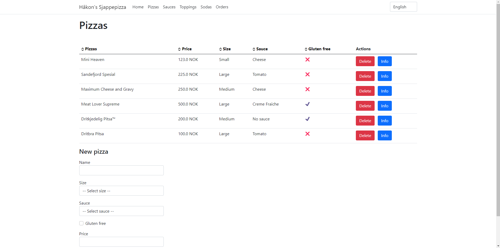

# Learning Razor Page

Small project focusing on learning ASP.NET Razor Pages and interaction with a 
database in .NET.

This website is based on the Contoso Pizza project from [this learning course](https://learn.microsoft.com/en-us/training/modules/create-razor-pages-aspnet-core/) at the Microsoft Training website.

After finishing the training course more functonality was added to the website
to train myself further in how Razor Pages work. Sauces, Toppings, Sodas, and 
Orders were added to the database along with views on the website to see and
edit these.

The website features language selection and functionality for sorting tables on
different columns.

## Website Structure

```
└── /
    ├── /Pizzas
    │   ├── /Info/{id}
    ├── /Sauces
    ├── /Toppings
    ├── /Sodas
    └── /Orders
```

## Examples

### Pizza Info Page


### Pizza Info Page


